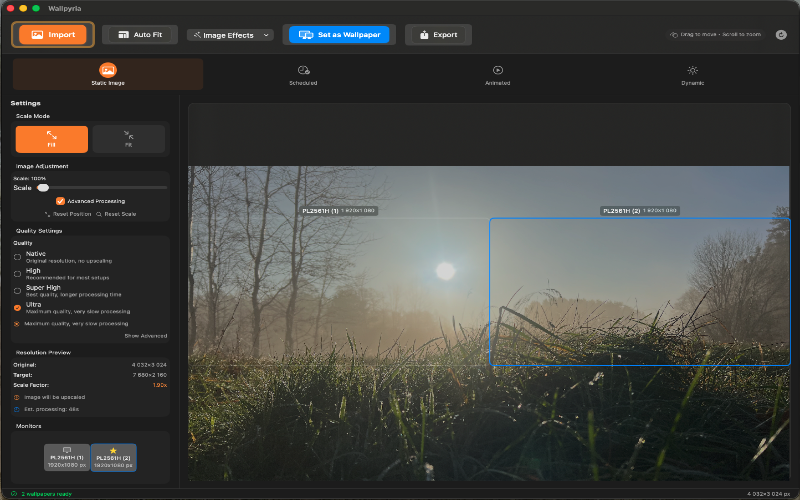
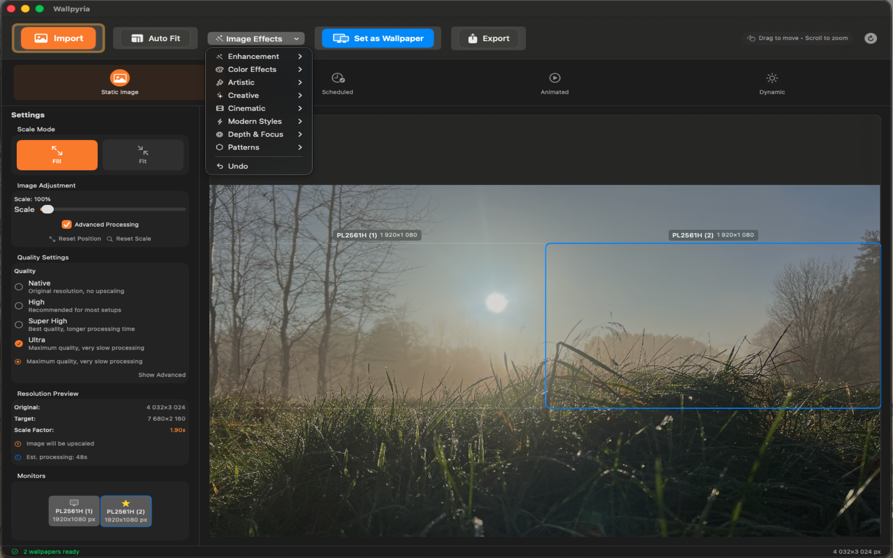
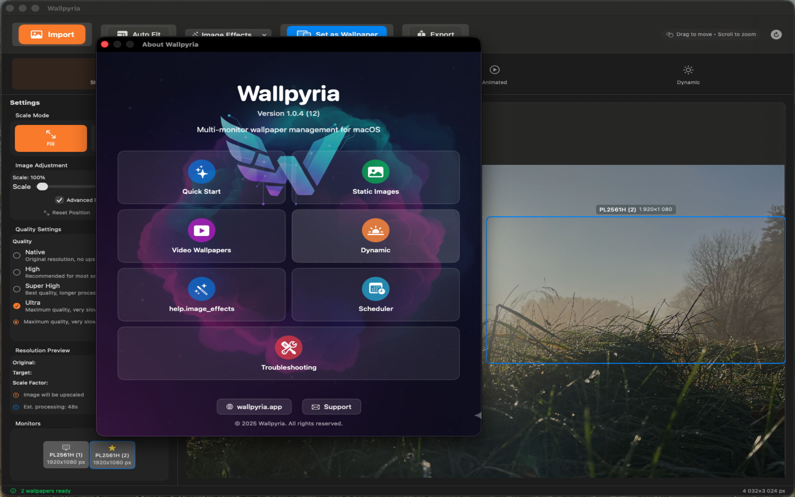

  

<h1 align="center">Wallpyria</h1>

  <strong>Professional Multi-Monitor Wallpaper Management for macOS</strong>

  
  

---

## Features

- **Static Wallpapers** — Single, different per monitor, or panorama
- **Animated Wallpapers** — Video backgrounds (.mov, .mp4)
- **Dynamic HEIC** — Time-based, solar position, appearance-based
- **Smart Scheduling** — Automatic rotation by time of day
- **ML Upscaling** — Machine learning image enhancement
- **Multi-Monitor** — Full support for any display configuration
- **9 Languages** — EN, PL, DE, FR, ES, IT, RU, JA, ZH

---

## Screenshots

<table>
  <tr>
    <td></td>
    <td></td>
  </tr>
  <tr>
    <td></td>
    <td></td>
  </tr>
</table>

---

## Pricing

| Plan | Price |
|------|-------|
| Monthly | $4.99/month |
| Annual | $49.99/year |
| Lifetime | $99.99 |

**14-day free trial** included.

---

  <a href="https://wallpyria.app">wallpyria.app</a>

